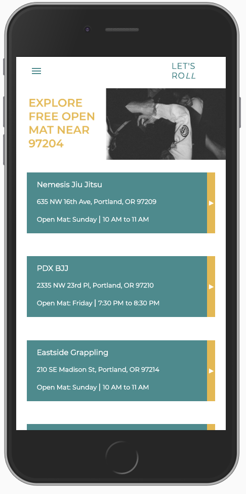

# Let's Roll!

#### _React Week 3 and 4, Capstone Project, 7.19.19_

#### By _**Ashley Jessica Ancheta**_

## Description

Let's Roll is an application to help people perfect their craft. It efficently connects Brazilian jiu jitsu practicioners, as well as people who are interested in starting jiu jitsu, to free open mat sessions in Portland, OR. 

In the world of jiu jitsu, to "roll" with someone means live sparring, which is the most important part of Brazilian Jiu Jitsu. Many academies will hold "open mat", welcome to everyone of all levels and backgrounds, where people roll together at no cost! During the open mat the clock is set to 5 minutes (or more) for each round. It not only invites the jiu jitsu community but people who are interested in the jiu jitsu culture as well!

## Technologies Used

  * _React 16.8.6_
  * _React-Redux 7.1.0_
  * _Webpack 3.12.0_
  * _React-Hot-Loader 3.1.3_
  * _Babel 6.26.3_
  * _eslint 4.19.1_
  * _Material UI 4.0.0-rc.0_
  * _JSX_
  * _GraphQL_
  * _Firebase_

  ## Setup / Installation Requirements

  ### To run the application run the following commands
  * `cd desktop` Navigate to the desktop.
  * `git clone "https://github.com/ajancheta/lets-roll.git"`
  * `cd lets-roll` Clone this repository to your desktop. 
  * `atom .` or `code .` Open the repository in a preferred text editor such as Atom or Visual Studio Code.
  * `npm install` This will allow the viewer of this project to have access to the CLI (command line interface) for webpack.
  * `npm run start` in the project directory in Terminal. 
  * Go to http://localhost:8080/ in the browser, preferably Google Chrome.
  * Note: The app will automatically reload if you change any of the source files. This is a continuous monitoring so to stop it just type the key combination `Ctrl + C` within the terminal.

# Planning

## User Stories
### Target Users 
* Users who train jiu jitsu 
* Users who are interested in the jiu jitsu community / culture
* Gym owners to expand their community 

### User Stories
| Behavior | Input | Output |
| ------------- |:-------------:| ------------- |
| User is welcomed with the landing page which prompts them to input a zip code and app will display nearby schools | "97239" |  "Nemesis Jiu Jitsu, Portland Judo / BJJ, Enzo Jiu Jitsu"|
| User selects a school that the app will list | User selects "Nemesis Jiu Jitsu" | App will take the user to details about Nemesis Jiu Jitsu |
| On the school detail page, user will select the map for directions | *User taps on map* | App will redirect user to Google Maps and directions will display |

## Component and Route Layout

## Sketch

## Wireframming

### Minimum Viable Product
- [x] Database of hours and locations of open mat sessions
- [] Display user’s current location and location of school shown on a map
- [] Accept user’s zip code and render nearby schools

### Stretch Goals
- [] User authentication
- [] Live feed of comments if hours / location change 
- [] Directions to jiu jitsu school from current location
- [] Search bar to navigate to specific school details

### Commit History / Activity Log
_Friday, July 19 - Planning_
* 8:00 - Create initial application files and folders & start README.
* 9:00 - Break down app into UI component hierarchy and create component tree.
* 10:30 - Update README to reflect component tree and consider what technologies will be used.
* 1:00 - Create sketch layout of the application.
* 2:00 - Create user stories and write out behavioral specs.
* 3:00 - List MVP and additional features to be added if MVP is met.
* 3:45 - Conduct research on jiu jitsu schools in Portland, OR and start to build out custom database. 
* 4:00 - Clean up README. Done for the day. 

## Known Bugs
There are no known bugs.

## Support and contact details
Please contact me at ashleyjancheta@gmail.com

Copyright (c) 2019 **_Ashley J. Ancheta_**